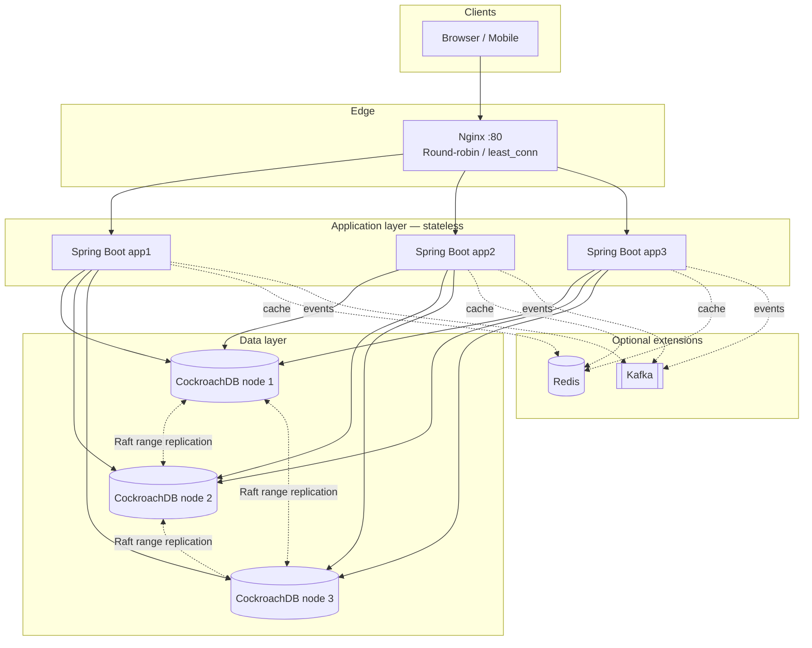

# Distributed Quiz System — Architecture & Deployment

This document describes a **production-like, student-scope** design: three stateless Spring Boot nodes, Nginx load balancing, a **three-node CockroachDB** cluster (automatic sharding and replication), **JWT** authentication, and optional **Redis** / **Kafka** extensions. **Kubernetes is not used.**

Supporting files in this repo:

| File | Purpose |
|------|---------|
| `docker-compose.yml` | 3× CockroachDB, 3× app, Nginx |
| `nginx/nginx.conf` | Load balancer upstream + health-oriented timeouts |
| `Dockerfile` | JRE image wrapping your built Spring Boot JAR |
| `config/application-docker.properties.example` | JDBC URL across 3 CRDB nodes |

---

## 1. System architecture

### 1.1 Logical diagram (Mermaid)



### 1.2 Explanation

- **Clients** talk only to **Nginx**. They do not pin a specific app instance.
- **Spring Boot** instances are **stateless**: no in-memory HTTP session; authentication is **JWT** (signed token on each request). Any instance can serve any request.
- **CockroachDB** presents a **single logical SQL database**. The cluster **splits data into ranges**, **replicates** each range (by default **3×** in multi-zone/multi-node setups), and uses **Raft** for consensus per range. **Rebalancing** moves replicas when nodes are added or fail (subject to surviving quorum).
- **Optional Redis** sits in front of hot reads (e.g. leaderboard) to reduce DB load and latency.
- **Optional Kafka** decouples **write** path from **slow work** (scoring, analytics, notifications) so API nodes stay fast and failures in consumers do not lose the HTTP acknowledgement path if you design idempotency carefully.

---

## 2. Step-by-step setup guide

### 2.1 Prerequisites

- Docker Engine + Docker Compose v2
- JDK 21 and Maven or Gradle for your Spring Boot quiz app
- Hibernate **6+** / Spring Boot **3.x** with `org.hibernate.orm:hibernate-core` (includes `CockroachDialect`)

### 2.2 Database bootstrap (first run)

1. Start the stack: `docker compose up -d` from the directory containing `docker-compose.yml`.
2. Wait until all three `crdb-*` containers are healthy (logs show cluster ready).
3. Create the application database **once** (uses the Compose service name `crdb-1`):

   ```bash
   docker compose exec crdb-1 cockroach sql --insecure -e "CREATE DATABASE IF NOT EXISTS quizdb;"
   ```

4. Run your Flyway/Liquibase migrations or JPA `ddl-auto` **once** against `quizdb` (student projects sometimes use `update` in dev only; use `validate` + migrations for anything “production-like”).

### 2.3 Spring Boot image

1. Build the JAR: `mvn -q -DskipTests package` (or Gradle `bootJar`).
2. Ensure `Dockerfile` `COPY` path matches your artifact (`target/*.jar` for Maven).
3. Add `application-docker.properties` to `src/main/resources` using `config/application-docker.properties.example` as a template.
4. `docker compose build` then `docker compose up -d`.

### 2.4 Verify

- `curl http://localhost/nginx-health` → `ok`
- `curl http://localhost/api/...` (your quiz API) through Nginx
- Open Cockroach Admin UI: `http://localhost:8081` (node 1), inspect **replication** and **ranges**

### 2.5 Simulating “three machines”

On a **single laptop**, Compose runs all containers on one kernel; you still get **real** multi-node CRDB and **real** multiple JVMs behind Nginx. To literally use three hosts:

- Run one Cockroach node + optionally one app per machine with the same `--join` hostnames **resolvable on your network**, or use IPs.
- Run Nginx on a fourth host or on one of the app hosts, with `upstream` pointing to the three app IPs/ports.
- Use the same JDBC idea: multiple hosts in the URL for failover.

---

## 3. Docker Compose layout (summary)

The provided `docker-compose.yml` defines:

| Service | Role |
|---------|------|
| `crdb-1`, `crdb-2`, `crdb-3` | CockroachDB cluster members |
| `app1`, `app2`, `app3` | Identical Spring Boot images (different containers) |
| `nginx` | Reverse proxy + load balancer on port 80 |

Cockroach is started with **`--insecure`** for simplicity (student lab). **Production** uses TLS certificates and `sslmode=verify-full`.

---

## 4. Spring Boot → CockroachDB cluster

### 4.1 Dependencies (`pom.xml`)

```xml
<dependency>
  <groupId>org.springframework.boot</groupId>
  <artifactId>spring-boot-starter-data-jpa</artifactId>
</dependency>
<dependency>
  <groupId>org.postgresql</groupId>
  <artifactId>postgresql</artifactId>
</dependency>
```

Cockroach is accessed via the **PostgreSQL driver**. Hibernate 6 registers **`CockroachDialect`** automatically in many Spring Boot versions; you can set it explicitly as in `application-docker.properties.example`.

### 4.2 JDBC URL (multi-host)

Use a **single URL** listing all CRDB nodes so the driver can **fail over** if a node is down:

```properties
spring.datasource.url=jdbc:postgresql://crdb-1:26257,crdb-2:26257,crdb-3:26257/quizdb?sslmode=disable
spring.datasource.username=root
```

Copy from `config/application-docker.properties.example`.

### 4.3 Stateless JWT (no server session)

- Use **Spring Security OAuth2 Resource Server** (`spring-boot-starter-oauth2-resource-server`) or **JJWT** / **Nimbus** to validate JWTs on every request.
- Do **not** use `HttpSession` for auth; set `server.servlet.session.persistent=false` and avoid `spring-session-jdbc` unless you have a deliberate requirement.
- Optionally cache **JWT public keys** or **introspection** results in memory with a short TTL (still stateless at the HTTP session level).

---

## 5. Nginx load balancing

The provided `nginx/nginx.conf`:

- Defines `upstream quiz_api` with **`least_conn`** (good for uneven request cost; default round-robin is also fine for uniform APIs).
- Sets **`proxy_set_header`** for `X-Forwarded-*` so your app can build correct absolute URLs if needed.
- Uses **`keepalive`** to upstreams to reduce connection churn.
- Exposes **`/nginx-health`** for quick checks without hitting Spring.

To switch to **pure round-robin**, remove `least_conn;` so Nginx uses its default RR.

---

## 6. How data is distributed and replicated (CockroachDB)

| Concept | What it means for your quiz app |
|---------|----------------------------------|
| **Ranges** | Tables/indexes are split into contiguous key **ranges** (automatic based on size and load). |
| **Replicas** | Each range has **N replicas** (default **3** when you have ≥3 nodes), placed according to **locality** / replication constraints. |
| **Raft** | Each range has a **Raft group**: one **leaseholder** serves consistent reads/writes for that range; writes are committed when a **quorum** of replicas acknowledges. |
| **Rebalancing** | When a node is lost or added, the **allocator** moves replicas to restore target replication and spread load. |
| **SQL** | Your app uses **normal SQL**; you do **not** manually shard tables like in many classic sharded MySQL setups. |

**Important nuance for students:** CockroachDB’s “sharding” is **automatic range splitting**, not manual application-level shard keys. You still get **distribution + replication + failover** without embedding shard logic in Spring.

---

## 7. Failure scenarios and system behavior

| Failure | What happens |
|---------|----------------|
| **One Spring Boot container dies** | Nginx marks upstream failed after `max_fails`; traffic goes to the other two. Users keep working if JWT and DB are fine. No session loss because there is no server session. |
| **Two Spring Boot containers die** | Remaining one serves all traffic; risk of **overload**, not data loss. |
| **One CockroachDB node dies** | Ranges that had replicas on that node **lose one replica**; **quorum** usually remains (2 of 3). Reads/writes continue. Surviving nodes may elect new leaseholders. |
| **Two CockroachDB nodes die** | Many ranges **lose quorum** → **writes (and strongly consistent reads) fail** for affected ranges until nodes return or you restore from backup. This is expected under CP-style behavior. |
| **Nginx dies** | **Total loss of entry point** unless you run a second LB (e.g. second Nginx + VIP/DNS round-robin). Single Nginx is acceptable for a student project if called out. |
| **Network partition (split brain)** | CockroachDB avoids classic split-brain on the same range: only a **quorum side** can commit writes. The minority side becomes **unavailable** for writes rather than diverging. |
| **Duplicate quiz submit** | Not solved by load balancing alone. Use **idempotency keys** (client-generated) or **unique constraint** on `(user_id, attempt_id)` and handle conflict in the service layer. |

---

## 8. Redis integration (suggested)

**Goals:** lower read latency, protect CRDB from hot keys (leaderboard), optional rate limiting.

| Pattern | Use case |
|---------|----------|
| **Cache-aside** | Read leaderboard from Redis; on miss, read SQL, populate Redis with TTL (e.g. 30–60s). |
| **Fixed window / token bucket** | Rate-limit login or submit using Redis counters. |
| **Distributed lock** | Rarely needed if DB constraints + idempotency suffice; prefer DB uniqueness for student scope. |

**Consistency:** after a write that affects cached data, **update or invalidate** the cache in the same request path, or accept **brief staleness** for leaderboard.

**Compose sketch (optional second file `docker-compose.redis.yml`):**

```yaml
services:
  redis:
    image: redis:7-alpine
    networks: [quiz-net]
    command: ["redis-server", "--appendonly", "yes"]
```

Add `spring-boot-starter-data-redis`, configure `spring.data.redis.host=redis`, and use `RedisTemplate` or `StringRedisTemplate` for leaderboard JSON.

---

## 9. Kafka integration (suggested)

**Goals:** async scoring, audit log, notifications, analytics without blocking HTTP.

| Topic (example) | Producer | Consumer |
|-----------------|----------|----------|
| `quiz.submitted` | API after DB insert of submission | Scoring worker updates score table |
| `quiz.scored` | Scoring worker | Notification service (email/push stub) |

**Design notes:**

- HTTP handler **persists durable row first** (source of truth), then **publishes event**; if publish fails, use **outbox table + scheduler** for stronger guarantees (advanced; for a student MVP, document “at-least-once publish” and make consumers **idempotent**).
- Consumers run as **separate Spring Boot app** or **small CLI consumer** in another Compose service `kafka-consumer`.

**Compose sketch:** add `bitnami/kafka` or `confluentinc/cp-kafka` (ZooKeeper or KRaft mode per image docs), expose port `9092` internally, set `spring.kafka.bootstrap-servers=kafka:9092`.

---

## 10. Security checklist (short)

- Replace `--insecure` Cockroach with **TLS** and matching JDBC `sslmode`.
- Do not commit secrets; use env vars or Docker secrets for DB passwords when you enable auth.
- Lock down Nginx (`limit_req` for login), strong JWT signing keys, short access token TTL + refresh strategy if needed.

---

## 11. Mapping to original course outline (Vietnamese summary)

- **Mục tiêu:** 3 node app, phân tán, một hệ thống thống nhất cho user; dữ liệu được **phân mảnh tự động** và **nhân bản** nhờ CockroachDB; chịu lỗi khi mất 1 node app hoặc 1 node DB (trong giới hạn quorum).
- **JWT:** xác thực không trạng thái, không session trong memory.
- **Nginx:** cân bằng tải tới 3 Spring Boot.
- **Redis / Kafka:** tùy chọn nhưng được khuyến nghị rõ ràng cho cache và xử lý bất đồng bộ.

---

## 12. Quick reference commands

```bash
docker compose up -d
docker compose ps
docker compose logs -f nginx
docker exec -it <crdb-container> cockroach sql --insecure -e "SHOW RANGES FROM TABLE quiz_submission;"
```

Replace table name with one from your schema to observe range distribution in the lab.
